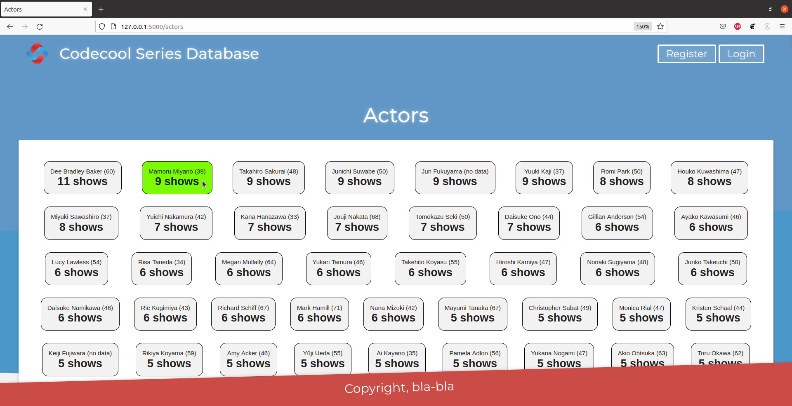

# Codecool Series
- This is a small web application on Python/Flask with PostgreSQL database.
- It contains a really basic DOM manipulation with Javascript.
- Filter with SQL: SQL: collecting all actors with their name, age (or age at death, if deceased) and number of shows the actor played in. Order the most active actor on top of the result.
- When the user hovers the cursor on any of these actors the following happens:
    If alive: the card background will be green
    If deceased: the card background will be dark and the text color will be white.

## Technology

- Python / Flask
- PostgreSQL
- HTML, CSS
- Javascript 

## Getting Started

- Clone the repository using the command git clone `https://github.com/kovesdieszter/CodecoolSeries.git`.
- Install all necessary packages asked by your IDE.
- Run `server.py`
- Then type `http://127.0.0.1:5000/actors`.
